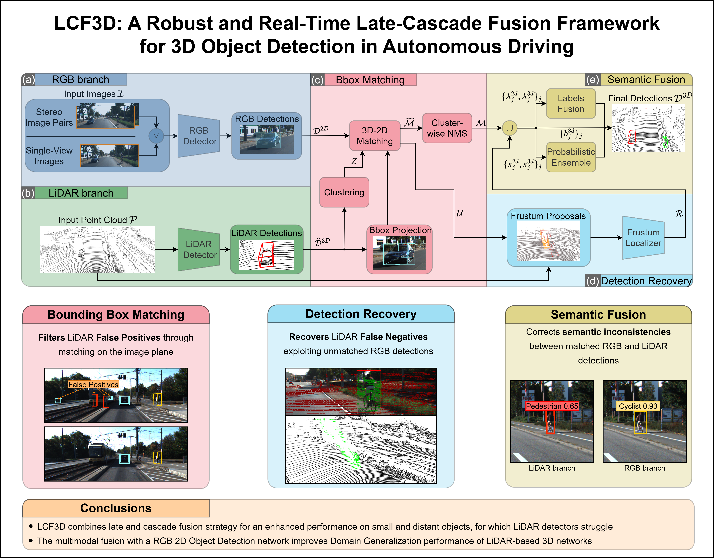

# LCF3D

Wersja robocza nuScenes: **[instalacja, modele, trening, walidacja i testy](docs/URUCHOMIENIE.md)**.
Zależności: `requirements.txt`; gotowe wagi: prywatne wydanie `models-v1`.




LCF3D is a modular late-cascade fusion framework for 3D object detection that combines LiDAR-based 3D detectors with camera-based 2D detectors. It supports **single-view**, **stereo**, and **multi-view** camera setups, and includes detection recovery via a Frustum Localizer for 2D detections that are missed by the 3D branch.

Paper can be accessed [here](https://arxiv.org/abs/2601.09812)

## Getting Started

### 1. Clone the repository

```
git clone https://github.com/mmr0z/LCF3D-nuscenes.git LCF3D
```

### 2. Install the python packages

We used torch 2.0.1 and cuda 11.7. Other versions compatible with mmcv, mmdet and mmdet3d are still possible but not guaranteed to work. To fully reproduce our environment follow these steps.

```
conda create -n lcf3d python=3.10
conda activate lcf3d
pip install torch==2.0.1 torchvision==0.15.2 --index-url https://download.pytorch.org/whl/cu117
pip install openmim
mim install mmengine
```

Install mmcv from source to make it compatible with the cuda version used to compile torch:
```
mim install git+https://github.com/open-mmlab/mmcv.git@v2.1.0 -v
```

Install mmdetection:
```
mim install git+https://github.com/open-mmlab/mmdetection.git@v3.3.0
```

Install mmdetection3d from our code (which is based on version 1.4.0):
```
cd LCF3D/src/mmdetection3d
pip install -e . -v
```

It may be necessary to install the following library versions for compatibility with mmdet and mmdet3d:
```
pip install numpy==1.23.0 numba==0.59.1 scipy==1.13.0
```

For nuScenes evaluation, install the devkit:
```
pip install nuscenes-devkit pyquaternion
```

## Data preparation

### KITTI

Follow these [instructions](https://mmdetection3d.readthedocs.io/en/latest/advanced_guides/datasets/kitti.html) to prepare the KITTI dataset. Additionally, download the right color images from [here](https://www.cvlibs.net/datasets/kitti/eval_object.php?obj_benchmark=3d) and place them in the dataset folder. After data preparation you should have the following structure:

```
kitti
├── ImageSets
│   ├── test.txt
│   ├── train.txt
│   ├── trainval.txt
│   └── val.txt
├── testing
│   ├── calib
│   ├── image_2
│   ├── image_3
│   ├── velodyne
│   └── velodyne_reduced
└── training
    ├── calib
    ├── image_2
    ├── image_3
    ├── label_2
    ├── velodyne
    └── velodyne_reduced
```

### nuScenes

Follow these [instructions](https://mmdetection3d.readthedocs.io/en/latest/advanced_guides/datasets/nuscenes.html) to prepare the nuScenes dataset. `eval_nuscenes.py` reads the dataset directly via the nuScenes devkit — no conversion to KITTI format is required for evaluation. For cross-dataset experiments (e.g. a KITTI-trained model evaluated on nuScenes), use the `dataset_utils/nuscenes2kitti.py` conversion script together with the `--kitti_to_nuscenes_lidar` flag in `eval_kitti.py`.

## Run the code

See the [Configuration](#configuration) section below for a detailed explanation of all hyperparameters.

### Pretrained weights

All pretrained weights are available in this [Google Drive folder](https://drive.google.com/drive/folders/1df0V3xUVWTf87PfI-kEDIWr9cRYSN84i?usp=sharing). The corresponding configuration files are in [src/model_configs/](./src/model_configs/).

| Model | Dataset | Config |
|---|---|---|
| Faster RCNN | KITTI | [kitti/faster_rcnn.py](./src/model_configs/kitti/faster_rcnn.py) |
| Faster RCNN | nuScenes + nuImages | [nuscenes/faster_rcnn_nuimages_nuscenes.py](./src/model_configs/nuscenes/faster_rcnn_nuimages_nuscenes.py) |
| DDQ | nuScenes + nuImages | [nuscenes/ddq_nuimages_nuscenes.py](./src/model_configs/nuscenes/ddq_nuimages_nuscenes.py) |
| Frustum Localizer (single-view) | KITTI | [kitti/frustum_pointnet_single_view.py](./src/model_configs/kitti/frustum_pointnet_single_view.py) |
| Frustum Localizer (stereo) | KITTI | [kitti/frustum_pointnet_stereo_view.py](./src/model_configs/kitti/frustum_pointnet_stereo_view.py) |
| Frustum Localizer | nuScenes | [nuscenes/frustum_pointnet_nuscenes.py](./src/model_configs/nuscenes/frustum_pointnet_nuscenes.py) |

For the LiDAR detector, pretrained mmdet3d models can be used directly, e.g. [PointPillars](https://github.com/open-mmlab/mmdetection3d/tree/main/configs/pointpillars).

### Demo and Visualization

To run a demo on a single sample (stereo setup):

```
python $HOME/LCF3D/src/demo.py \
  -output_dir /path/to/output/folder \
  -img_path_left /path/to/image_2/000001.png \
  -img_path_right /path/to/image_3/000001.png \
  -lidar_path /path/to/velodyne/000001.bin \
  -calib_path /path/to/calib/000001.txt \
  -late_fusion_config /path/to/cfg.json \
  -device cuda:0 \
  --visualize
```

The calibration file must be in the standard KITTI format. `img_path_left` corresponds to the camera described by P2, `img_path_right` to P3. With `--visualize`, the following files are saved in `output_dir`:

```
output_dir/
├── fusion_detections_left_proj.png   # final 3D detections projected on the left image
├── lidar_detections_left_proj.png    # 3D detector output before fusion
├── rgb_detections_left.png           # 2D detector output on the left image
├── rgb_detections_right.png          # 2D detector output on the right image
└── predictions.pkl                   # raw InstanceData with bboxes, scores, labels
```

### Evaluation on KITTI

```
python $HOME/LCF3D/src/eval_kitti.py \
  -output_dir /path/to/output \
  -kitti_root_path /path/to/kitti/training \
  -annotation_file_eval /path/to/kitti/kitti_infos_val.pkl \
  -validation_split_path /path/to/kitti/ImageSets/val.txt \
  -late_fusion_config /path/to/cfg.json \
  -device cuda:0 \
  --view stereo
```

Use `--view single` to run in single-view mode (left camera only). The script produces a timestamped folder under `output_dir` containing:
- `metrics.json` — KITTI and nuScenes-style metrics
- `predictions.pkl` — raw predictions
- `config.json` — snapshot of the configuration used
- `log.txt` — run log

**Cross-dataset flags** (for models trained on nuScenes evaluated on KITTI-format data):

| Flag | Description |
|---|---|
| `--kitti_to_nuscenes_lidar` | Rotate KITTI points into the nuScenes lidar frame before inference, then rotate boxes back |
| `--kitti_num_features N` | Number of features per point (default: 4) |
| `--kitti_points_dim_mode` | `xyzi` / `xyzit` / `xyzt` (default: `xyzi`) |
| `--kitti_intensity_divisor` | Divide intensity by this value (e.g. `255.0`) |
| `--kitti_is_float64_bin` | Load `.bin` files as float64 |

### Evaluation on nuScenes

```
python $HOME/LCF3D/src/eval_nuscenes.py \
  -output_dir /path/to/output \
  -nuscenes_root_path /path/to/nuscenes \
  -late_fusion_config /path/to/cfg.json \
  -device cuda:0
```

The nuScenes evaluator uses `LateFusionMultiViewInferencer` and reads calibration data directly from the nuScenes devkit for each sample.

### Thesis evaluation and metrics

Use the full validation split for reported results. The wrappers validate the
dataset/checkpoint paths, preserve the evaluated configuration and export raw
metrics plus CSV/Markdown tables:

```bash
# Camera branch: COCO AP/AP50/AP75, AP by object size, AR and per-class AP
./src/test_nuscenes_camera2d.sh

# Complete LCF3D: official nuScenes mAP, NDS, TP errors and per-class metrics
./src/test_lcf3d_nuscenes.sh

# Controlled LiDAR-only ablation with the native CenterPoint score floor
./src/test_lcf3d_nuscenes.sh --no_progress \
  --fusion_overrides_json \
  '{"lidar_only":true,"score_thr_3d":[0.1,0.1,0.1,0.1,0.1,0.1,0.1,0.1,0.1,0.1]}'
```

Useful environment overrides are `LCF3D_PYTHON`, `LCF3D_DEVICE`,
`LCF3D_NUSCENES_ROOT`, `LCF3D_CAMERA_CHECKPOINT`, `LCF3D_FUSION_CFG`, and
`LCF3D_RUN_NAME`. Each run writes a `thesis_metrics/` directory containing
`summary.csv`, `per_class.csv`, `thesis_metrics.json`, and
`thesis_report.md`. The full-fusion test also records end-to-end latency and
throughput after model initialization.

`--fusion_overrides_json` recursively merges a JSON object into the selected
configuration and writes the resolved settings to `effective_fusion_config.json`
inside the run directory. This makes one-off ablations reproducible without
editing the base config.

Existing runs or several ablations can be converted without rerunning
inference:

```bash
python src/analyze_thesis_metrics.py \
  /path/to/baseline_eval /path/to/fusion_eval \
  --labels baseline full_fusion \
  --output-dir work_dirs/thesis_comparison
```

COCO 2D AP and nuScenes 3D AP are different protocols and must not be treated
as directly comparable values.

## Configuration

All hyperparameters are specified in a single JSON file. Example configs are provided in [src/configs/](./src/configs/):

| File | Description |
|---|---|
| `example_cfg.json` | Single-view setup (KITTI) |
| `example_cfg_stereo.json` | Stereo setup with clustering (KITTI) |
| `example_cfg_clustering.json` | Single-view with clustering |
| `example_cfg_nuscenes.json` | Multi-view setup (nuScenes) |
| `example_cfg_yolo.json` | Single-view with Ultralytics YOLO as 2D detector |

### Key parameters

#### Detection thresholds

| Parameter | Type | Description |
|---|---|---|
| `score_thr_2d` | float or list | Per-class (or global) score threshold for 2D detections |
| `score_thr_3d` | float or list | Per-class (or global) score threshold for 3D detections |

#### 3D–2D matching

| Parameter | Default | Description |
|---|---|---|
| `bbox_matching_iou_thr` | 0.4 | Minimum IoU to consider a 3D–2D pair a match |
| `bbox_matching_mode` | `"iou"` | IoU mode: `"iou"` or `"iof"` |
| `use_clustering` | false | Group nearby 3D boxes into clusters before matching |
| `clustering_method` | `"connected_components"` | `"connected_components"` or `"cliques"` |
| `cluster_bev_iou_thr_cc` | 0.5 | BEV IoU threshold for connected-components clustering |
| `cluster_bev_iou_thr_clique` | 0.3 | BEV IoU threshold for clique clustering |

#### Detection recovery (Frustum Localizer)

| Parameter | Default | Description |
|---|---|---|
| `use_detection_recovery` | true | Enable frustum-based recovery for unmatched 2D boxes |
| `detection_recovery_iou_thr` | 0.3 | Minimum 2D IoU to accept a recovered 3D box |
| `min_pts_frustum` | 10 | Minimum number of LiDAR points required in a frustum |
| `align_frustum` | true | Rotate the frustum to face the camera centre before detection |
| `enlarge_factor` | 0.05 | Factor by which to enlarge 2D boxes before extracting the frustum |
| `use_gaussian_likelihoods` | true | Weight frustum points by their Gaussian distance to the 2D box centre |
| `detection_recovery.valid_labels` | all classes | Unified class indices allowed to produce recovered boxes |
| `detection_recovery.score_thr` | 0.0 | Scalar or per-class minimum score for recovered boxes |
| `detection_recovery.lidar_iou_thr` | 0.1 | Reject a recovered box when its BEV IoU with a same-class LiDAR box exceeds this value |

#### Score and label fusion

| Parameter | Default | Description |
|---|---|---|
| `use_label_fusion` | true | Replace a mismatching 3D label with the matched 2D label |
| `use_score_fusion` | true | Fuse 3D and 2D scores using class priors |
| `class_prior` | `[0.33, 0.33, 0.33]` | Prior probability for each class |

#### Post-processing

| Parameter | Default | Description |
|---|---|---|
| `use_final_nms` | false | In multi-view additive recovery, apply multi-class NMS only among recovered Frustum detections |
| `final_nms_cfg.thresh` | 0.3 | NMS IoU threshold |
| `keep_oov_bboxes` | false | Include 3D boxes that are out-of-view of all cameras |
| `keep_unmatched_3d` | false | Preserve valid LiDAR detections without a 2D match |
| `lidar_only` | false | Bypass the camera, Frustum and fusion stages for a controlled baseline |

Multi-view aggregation keys camera matches by the original LiDAR detection
index. A box visible in several cameras is emitted only once. With
`keep_unmatched_3d=true` and label/score fusion disabled, CenterPoint boxes,
scores and labels are preserved exactly; recovery can only append new boxes.

#### Detectors

The `detector2d`, `detector3d` and `frustum_detector` blocks each specify `cfg_path` and `checkpoint_path`. The 2D detector additionally accepts:

| Key | Description |
|---|---|
| `model_type` | `"mmdet"` or `"ultralytics"` |
| `nms_thr` / `nms_pre` / `max_num` | Override the model's built-in NMS settings |
| `valid_2d_classes` | Indices of classes to keep from the 2D detector output |
| `img_label_mapping` | Maps 2D detector class indices to the unified class space |

The `detector3d` block similarly accepts `valid_labels_3d` and `class_mapping_3d` for class remapping, and `nms_thr` / `nms_pre` / `max_num` to override the 3D detector NMS.

For the local MMDetection3D nuScenes annotations, `class_names`, the flattened
CenterPoint task list, and the unified fusion labels must all use this order:
`car, truck, trailer, bus, construction_vehicle, bicycle, motorcycle,
pedestrian, traffic_cone, barrier`. `train_nuscenes.sh` validates the order
against `nuscenes_infos_train.pkl` before starting training.

## Training a Frustum Localizer

### 1. Create the dataset

**Single-view:**
```
python $HOME/LCF3D/src/dataset_utils/create_frustum_dataset_single_view.py \
  --out_path /path/to/output \
  --kitti_path /path/to/kitti \
  --min_points_per_frustum 10
```

**Stereo:**
```
python $HOME/LCF3D/src/dataset_utils/create_frustum_dataset_stereo.py \
  --out_path /path/to/output \
  --kitti_path /path/to/kitti \
  --min_points_per_frustum 10
```

### 2. Create a configuration file

See [src/model_configs/frustum_pointnet.py](./src/model_configs/frustum_pointnet.py) for a reference configuration. Set `data_root` to the output path of the previous step.

### 3. Train

```
python $HOME/LCF3D/src/mmdetection3d/tools/train.py \
  /path/to/frustum_config.py \
  --work-dir /path/to/checkpoints
```

## Citation

If you find this project useful, please consider citing our work.

```
@article{sgaravatti2026lcf3d,
  title={LCF3D: A Robust and Real-Time Late-Cascade Fusion Framework for 3D Object Detection in Autonomous Driving},
  author={Sgaravatti, Carlo and Pieroni, Riccardo and Corno, Matteo and Savaresi, Sergio M and Magri, Luca and Boracchi, Giacomo},
  journal={Pattern Recognition},
  pages={113046},
  year={2026},
  publisher={Elsevier}
}
```

## Acknowledgements

This repository is built upon [mmdetection3d](https://github.com/open-mmlab/mmdetection3d) and [mmdetection](https://github.com/open-mmlab/mmdetection).
Our implementation of the Frustum Localizer is highly inspired by [Frustum PointNets](https://github.com/charlesq34/frustum-pointnets).
